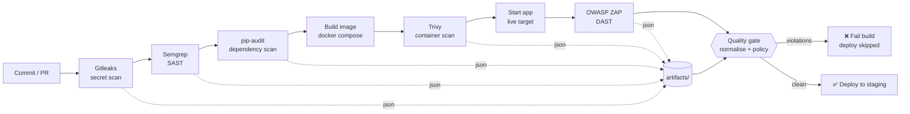

# 🛡️ secure-ci-pipeline — a DevSecOps CI/CD security gate

> secure-ci-pipeline is a GitHub Actions pipeline that runs a layered set of
> security scanners on every commit and pull request, then feeds all of their
> output into a single, policy-driven **quality gate** that blocks deployment
> when High or Critical issues are present.

The interesting part of this project is not any one scanner — those are all
off-the-shelf and open-source. It is the **centralised gate** (`gate/gate.py`):
a small, well-tested piece of Python that normalises four very different tool
outputs onto one severity scale and makes a single, auditable *ship / do-not-ship*
decision from a version-controlled policy.

> 🧪 **This repository is set up as a "PR blocks merge" demonstration.** The
> `main` branch holds a **clean** app and its pipeline passes green. A feature
> branch, `add-user-feature`, introduces three planted vulnerabilities and an
> outdated dependency; when it is opened as a pull request against `main`, the
> pipeline **fails the gate and blocks the merge**. See
> [Demo: the PR that gets blocked](#demo-the-pr-that-gets-blocked).

> ⚠️ The application under test is a deliberate scan target. Do not deploy it
> publicly, even in its clean state.

---

## Table of contents

- [Overview](#overview)
- [Demo: the PR that gets blocked](#demo-the-pr-that-gets-blocked)
- [Architecture](#architecture)
- [Repository layout](#repository-layout)
- [The scanners — what each one catches](#the-scanners--what-each-one-catches)
- [The planted vulnerabilities](#the-planted-vulnerabilities)
- [How the quality gate works](#how-the-quality-gate-works)
- [The normalisation layer](#the-normalisation-layer)
- [The security policy](#the-security-policy)
- [Running it locally](#running-it-locally)
- [The CI/CD pipeline](#the-cicd-pipeline)
- [What automated scanners miss](#what-automated-scanners-miss)
- [Extending the pipeline](#extending-the-pipeline)

---

## Overview

secure-ci-pipeline demonstrates a practical "shift-left" security pipeline that a team can
run entirely for free, with no cloud account and no paid tooling. On every push
and pull request it:

1. Scans for **secrets** (Gitleaks).
2. Runs **SAST** on the source (Semgrep).
3. Audits **dependencies** for known CVEs (pip-audit).
4. Builds the container image and runs a **container scan** (Trivy).
5. Runs a **DAST** scan against the running application (OWASP ZAP).
6. Feeds every scanner's JSON into the **quality gate**, which applies policy and
   decides whether the build may proceed.
7. Deploys to a staging environment **only if the gate passes**.

The design principle throughout is that **individual scanners are non-blocking
data collectors, and the gate is the single decision point.** Security policy
therefore lives in one reviewable file (`gate/policy.yml`) instead of being
scattered across a dozen CLI flags in the workflow.

---

## Demo: the PR that gets blocked

This repository is arranged as a self-contained demonstration of a security gate
stopping a bad change from being merged.

| Branch | App state | Dependencies | Pipeline result |
| --- | --- | --- | --- |
| `main` | **Clean** — SQLi, XSS and IDOR all fixed | Current, patched | ✅ **Green** — gate passes, deploy runs |
| `add-user-feature` | **Vulnerable** — the three flaws planted | Adds `requests==2.19.1` (CVE-2018-18074) | ❌ **Red** — gate blocks, merge prevented |

**The only difference between the branches is two files** —
`vulnerable_app/app.py` (the three flaws) and `vulnerable_app/requirements.txt`
(the outdated dependency) — so the pull-request diff reads as a focused,
realistic "developer adds a feature and introduces security regressions".

**To reproduce the demo on GitHub:**

1. Push both branches to a GitHub repository (make `main` the default branch).
2. Enable branch protection on `main` and mark the pipeline's status check as
   **required** (this is what turns a red pipeline into a hard merge block).
3. Open a pull request from `add-user-feature` into `main`.
4. Watch the pipeline run on the PR: Semgrep reports the SQL injection, ZAP
   reports the reflected XSS, and pip-audit and Trivy report the vulnerable
   `requests` pin. The gate exits non-zero, the check goes red, and **merge is
   blocked**.

When the gate runs against the sample data it looks like this — five violations,
so the merge is blocked:

> The gate found violations in `semgrep`, `pip-audit`, `trivy` and `zap`, exited
> `1`, and the deploy job never started.

---

## Architecture



In plain terms: every scanner drops a JSON report into a shared `artifacts/`
directory; the gate reads them all, normalises them, applies policy, and returns
exit code `0` (pass) or `1` (fail). A non-zero gate fails the CI job, and the
deploy job — which `needs:` the pipeline job — is therefore never reached.

```
   scanners (data collectors)             gate (decision)            outcome
   ────────────────────────────           ────────────────           ───────
   gitleaks  ─┐
   semgrep   ─┤                       ┌── normalise ──┐
   pip-audit ─┼─►  artifacts/*.json ──┤  suppress     ├──►  exit 0 ─► deploy ✅
   trivy     ─┤                       └── threshold ──┘      exit 1 ─► block  ❌
   zap       ─┘
```

---

## Repository layout

```
secure-ci-pipeline/
├── .github/workflows/security.yml   # the CI/CD pipeline
├── vulnerable_app/                  # intentionally-vulnerable Flask app (scan target)
│   ├── app.py                       #   3 planted vulns: SQLi, XSS, IDOR
│   ├── requirements.txt             #   1 dependency pinned to a known CVE
│   └── Dockerfile
├── gate/                            # the centralised quality gate
│   ├── gate.py                      #   normalise → suppress → threshold → decide
│   ├── report.py                    #   render findings into a Markdown report
│   └── policy.yml                   #   version-controlled security policy
├── samples/                         # example scanner outputs, so the gate is
│   ├── semgrep.json                 #   runnable locally without the full CI
│   ├── pip-audit.json
│   ├── trivy.json
│   └── zap.json
├── docker-compose.yml
├── Makefile                         # convenience targets for local runs
└── README.md
```

---

## The scanners — what each one catches

secure-ci-pipeline deliberately layers several classes of tool, because each one sees a
different slice of the risk surface.

| Stage | Tool | Class | What it catches | Blocks the build? |
| --- | --- | --- | --- | --- |
| Secrets | **Gitleaks** | Secret scanning | Hard-coded API keys, tokens, credentials in the repo | Informational (see [Extending](#extending-the-pipeline)) |
| SAST | **Semgrep** | Static analysis | Insecure *code* patterns — e.g. string-formatted SQL, unsafe deserialisation | Yes (High/Critical) |
| Dependencies | **pip-audit** | Software composition analysis | Known CVEs in third-party Python packages | Yes (High/Critical) |
| Container | **Trivy** | Image / OS scanning | CVEs in the base image OS packages and installed libraries | Yes (Critical) |
| DAST | **OWASP ZAP** | Dynamic analysis | Runtime issues on the *live* app — e.g. reflected XSS, missing headers | Yes (High/Critical) |

The blocking thresholds above are policy, not code — see
[The security policy](#the-security-policy).

---

## The planted vulnerabilities

On the `add-user-feature` branch the demo app contains **exactly three**
deliberately-planted application vulnerabilities, plus **one** deliberately-outdated
dependency. (On `main` all four are fixed.) Each is chosen to show a *different*
detection story.

| # | Vulnerability | Where | Detected by | Why |
| --- | --- | --- | --- | --- |
| 1 | **SQL injection** | `/user?username=` | SAST (Semgrep) | The query is built with string formatting — a static, source-visible pattern. |
| 2 | **Reflected XSS** | `/greet?name=` | DAST (OWASP ZAP) | User input is reflected unescaped; it is a *runtime* behaviour, so a live scan surfaces it. |
| 3 | **IDOR / broken access control** | `/account/<id>` | *Typically neither* | The code looks correct and returns a valid 200; only business-context review catches it. See [What automated scanners miss](#what-automated-scanners-miss). |
| — | **Vulnerable dependency** | `requests==2.19.1` | SCA (pip-audit) + container (Trivy) | Pinned to a release affected by **CVE-2018-18074** (CVSS 9.8 — leaks the `Authorization` header on an https→http redirect). |

Each planted issue in `app.py` (on the `add-user-feature` branch) is marked with
an `# INTENTIONALLY VULNERABLE:` comment so reviewers can find them quickly. On
`main`, the same three spots carry `# SECURE:` comments explaining the fix, and
`requests` is not present — so `git diff main..add-user-feature -- vulnerable_app`
shows exactly the regression.

> **Why `requests==2.19.1` is declared but not imported:** the vulnerable branch
> lists the outdated dependency in `requirements.txt` so pip-audit and Trivy flag
> it, but the application code does not `import requests`. This is deliberate:
> `requests 2.19.1` pulls in `urllib3 1.23`, which fails to import on Python 3.10+
> (it references the removed `collections.Mapping`). Declaring it without
> importing keeps the app runnable for the ZAP scan while still tripping the
> dependency and container scanners.

---

## How the quality gate works

`gate/gate.py` is the heart of the project. It runs in six clear phases:

1. **Load policy** — read `policy.yml` (falling back to safe defaults if it is
   missing or malformed: fail closed on High and Critical).
2. **Read reports** — read `semgrep.json`, `pip-audit.json`, `trivy.json` and
   `zap.json` from the artifacts directory. Missing or malformed files are
   skipped with a warning rather than crashing the build.
3. **Normalise** — convert each tool's bespoke output into a common `Finding`
   record on one shared severity scale (see below).
4. **Suppress** — drop findings that the policy explicitly accepts (documented
   risk acceptances and triaged false positives).
5. **Apply thresholds** — for each finding, use the **per-tool** `block_on` set
   if one is defined, otherwise the **global** one. Anything at a blocking
   severity becomes a *violation*.
6. **Decide** — print a clear summary, write the Markdown report, and
   `sys.exit(1)` if there are any violations, else `exit(0)`.

The common record is intentionally tiny:

```python
@dataclass(frozen=True)
class Finding:
    tool: str        # "semgrep" | "trivy" | "pip-audit" | "zap"
    severity: str    # critical | high | medium | low | info
    title: str       # short human-readable description
    location: str    # file:line, package, or URL
    rule_id: str     # stable id used for suppressions
```

Example gate output (run against the bundled samples):

```
====================================================================
  SECURE-CI-PIPELINE SECURITY QUALITY GATE
====================================================================
  Scanners parsed : semgrep, pip-audit, trivy, zap
  Findings        : 11 total  ->  CRITICAL=2  HIGH=5  MEDIUM=2  LOW=1  INFO=1
  Suppressed      : 2
====================================================================
  POLICY VIOLATIONS (5):
    [CRITICAL] trivy     CVE-2018-18074
    [HIGH    ] pip-audit CVE-2018-18074
    [HIGH    ] pip-audit CVE-2023-32681
    [HIGH    ] semgrep   python.sqlite.security.formatted-sql-query...
    [HIGH    ] zap       40012  (Cross Site Scripting (Reflected))
====================================================================
GATE FAILED: 5 policy violation(s) block deployment.
```

---

## The normalisation layer

Every scanner has its own severity vocabulary. The gate maps them all onto one
scale — `critical > high > medium > low > info` — so a single policy can reason
about all of them uniformly. This mapping is the crux of the whole design.

| Tool | Native severity | Maps to |
| --- | --- | --- |
| **Semgrep** | `ERROR` / `WARNING` / `INFO` | high / medium / info |
| **Trivy** | `CRITICAL` / `HIGH` / `MEDIUM` / `LOW` / `UNKNOWN` | critical / high / medium / low / info |
| **pip-audit** | *(usually no severity field)* | `default_severity` from policy (**high**); an explicit label is honoured if present |
| **OWASP ZAP** | `riskcode` `3` / `2` / `1` / `0` | high / medium / low / info |

Two details worth calling out, because they reflect real-world scanner quirks:

- **pip-audit rarely emits a severity.** Its JSON lists the vulnerability id and
  the fix version, but not a CVSS rating. Rather than guess or ignore it, the
  normaliser treats any known-vulnerable dependency as **high** by default (this
  is configurable per-tool in the policy). Treating "there is a public CVE in
  your dependency" as high-by-default is a deliberate fail-safe posture.
- **ZAP's `riskcode` is a string** in the JSON report and tops out at `3`
  (High) — ZAP has no "Critical" band — so the normaliser coerces it to an
  integer and maps accordingly.

Every normaliser is written to tolerate empty or partially-missing structures, so
an empty scan result (`{}`) or a scanner that found nothing never causes a crash.

---

## The security policy

`gate/policy.yml` is the single source of truth for what blocks a deployment.
Changing security posture is therefore a reviewable pull request, not an edit
buried in CI YAML.

```yaml
block_on: [critical, high]          # global threshold

tools:
  trivy:
    block_on: [critical]            # per-tool override: base-image OS CVEs are
                                    # noisy, so only Critical blocks here
  pip-audit:
    default_severity: high          # assume high when pip-audit omits severity

suppressions:
  - rule_id: CVE-2023-45853
    tool: trivy
    reason: >-
      Accepted risk (SEC-207): flaw is in minizip code this image never reaches;
      no fixed Debian package yet. Re-review by 2026-09-30.
```

The policy supports three things:

- **`block_on`** — the global set of severities that fail the build.
- **`tools.<tool>.block_on`** — a per-tool override. In the sample policy, Trivy
  blocks only on **Critical** (because base-image OS CVEs are numerous and often
  un-fixable in the short term), while everything else blocks on High and above.
  This keeps the pipeline actionable instead of permanently red.
- **`suppressions`** — a list of accepted risks / triaged false positives,
  matched by `rule_id` (optionally scoped to one `tool`). Each entry carries a
  mandatory `reason`, so every exception is documented and auditable.

---

## Running it locally

You do not need the full CI to see the gate work — the `samples/` directory
contains realistic scanner outputs.

**Run the gate against the sample data:**

```bash
pip install pyyaml                 # the gate's only runtime dependency
make demo                          # or: python gate/gate.py --artifacts samples --report artifacts/security-report.md
echo "exit code: $?"               # 1, because the samples contain High/Critical findings
```

This prints the summary, writes `artifacts/security-report.md`, and exits `1`.

**Run the vulnerable app** (requires Docker):

```bash
make up                            # docker compose up -d
curl "http://localhost:5000/user?username=alice"
curl "http://localhost:5000/greet?name=<script>alert(1)</script>"
curl "http://localhost:5000/account/1002"    # IDOR: another user's account
make down
```

**Useful Make targets:**

```bash
make help      # list all targets
make demo      # run the gate against samples/
make report    # render the Markdown report from samples/
make build     # build the container image
make clean     # remove generated artifacts and the local DB
```

---

## The CI/CD pipeline

`.github/workflows/security.yml` defines the pipeline. All action versions are
pinned. The steps run in this order:

| # | Step | Output | Blocking? |
| --- | --- | --- | --- |
| 1 | Secret scan (Gitleaks) | `artifacts/gitleaks.json` | No (informational) |
| 2 | SAST (Semgrep) | `artifacts/semgrep.json` | No — the gate decides |
| 3 | Dependency scan (pip-audit) | `artifacts/pip-audit.json` | No — the gate decides |
| 4 | Build Docker image | `secure-ci-pipeline-app:ci` | Build failure fails the job |
| 5 | Container scan (Trivy) | `artifacts/trivy.json` | No — the gate decides |
| 6 | DAST (OWASP ZAP baseline) | `artifacts/zap.json` | No — the gate decides |
| 7 | **Quality gate** (`gate.py`) | `artifacts/security-report.md` | **Yes — the one decision point** |
| 8 | Deploy to staging | `docker compose up` | Runs only if the gate passed |

A few deliberate choices:

- **The scanners never fail the build directly** (`continue-on-error`, `exit-code: 0`,
  `fail_action: false`). This guarantees the gate always runs with complete data
  and remains the single authority on pass/fail.
- **Deploy is a separate job** that `needs: security-pipeline`. If the gate exits
  non-zero, the pipeline job fails and the deploy job simply never starts — the
  gating comes for free from the job dependency graph.
- **Evidence is always uploaded** (`if: always()`), even when the gate blocks, so
  the JSON reports and the Markdown report are available on every run.
- **Least-privilege token**: the workflow declares `permissions: contents: read`.

> **A note on the ZAP baseline scan:** the baseline scan is *passive* — it
> spiders the app and runs passive rules. Passive scanning reliably flags issues
> like missing security headers and reflected parameters; switching the action to
> `zaproxy/action-full-scan` enables active injection testing, which confirms the
> reflected XSS with a live payload. The baseline is used here to keep runs fast
> and deterministic; the sample `zap.json` shows the reflected-XSS alert that a
> full scan produces.

---

## What automated scanners miss

The third planted bug — the **IDOR** at `GET /account/<id>` — is in the pipeline
on purpose, and **none of the scanners report it.** That is the point.

```python
# vulnerable_app/app.py
@app.route("/account/<int:account_id>")
def get_account(account_id: int):
    # The query is safely parameterised — no injection here.
    row = cur.execute(
        "SELECT id, owner_id, balance, iban FROM accounts WHERE id = ?",
        (account_id,),
    ).fetchone()
    return jsonify(dict(row))          # ...but nobody checked who is asking.
```

Why each layer misses it:

- **SAST (Semgrep)** sees a correctly parameterised query and a normal request
  handler. There is no dangerous *code pattern* to match — the flaw is the
  *absence* of an authorisation check, which static rules cannot infer without
  knowing the application's ownership model.
- **DAST (OWASP ZAP)** sends `GET /account/1002`, receives a perfectly valid
  `200 OK` with JSON, and moves on. Without a concept of "user A should not be
  able to read user B's account", a healthy response looks like success.
- **Dependency and container scanners** are not even looking at this class of
  problem.

Broken access control (OWASP Top 10 **A01:2021**) is consistently one of the most
common and most serious real-world vulnerability classes, and it is precisely the
kind of **business-logic** flaw that tooling struggles with. The takeaway that
this project is built to make concrete:

> **Automated scanning is necessary but not sufficient.** A gate like this one
> raises the floor and catches regressions cheaply on every commit, but it does
> not replace threat modelling, authorisation-aware testing, and manual security
> review. Use the automation to free up human attention for the logic flaws that
> only humans can find.

---

## Extending the pipeline

The gate is built to grow. Some natural next steps:

- **Wire secret findings into the gate.** Gitleaks currently runs as an
  informational check; adding a `normalize_gitleaks()` function and one line in
  the `SCANNERS` registry would make leaked secrets a hard block (secrets are a
  good candidate for "block on any finding").
- **SARIF output** to surface findings natively in the GitHub Security tab.
- **CVSS-aware pip-audit** — parse the OSV CVSS vectors instead of defaulting to
  high, for finer-grained thresholds.
- **Trend/baseline mode** — fail only on *new* findings relative to the base
  branch, so a large existing backlog does not block every PR.
- **A `fail_on_missing_scans` policy switch** — treat a missing scanner report as
  a failure (fail-closed) rather than skipping it, for high-assurance pipelines.

---

## A note on this repository

This is a **portfolio / learning project** for an Application Security Engineer
role. The application is intentionally insecure and must never be exposed
publicly. Everything here is free and open-source and runs without any cloud
account.
